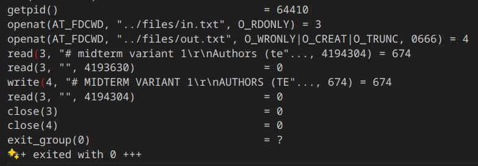

# midterm variant 1
Authors (team): 
- Roman Zaletskyi (https://github.com/Romko-studik)

## Prerequisites

C++:
-boost
### Compilation

```bash
mkdir cmake-build-debug
cd cmake-build-debug
cmake ..
cmake --build .
```

### Usage

```bash
./build/capitilizer <input_file><output_file>
```

### Results

The ressult of running the capitilizer file is a copied input file with capitilized letters in the output file. It first reads input file into buffer(4 MB) then capitilizes it by character into output buffer, which is then written to output file.

### Analizing using strace

The strace output is includded int the files folder, but here is the overall summary:
We can see that the main() starts at line 84 of our strace file, with syscall getpid(). Before that all the syscalls are needed to setup the program. 
    Here are all the syscalls after the start of main()
    

I used getpid() just to track the start of main(),although it is not neccesary, as it can be clearly seen by 2 openat() in succession which are called in main to open our input and output files.
After that:     
- read is called in function readbuffer(which is called in capitilize()), which reads our input file into a buffer.
- second consecutive read is called by itself to check if more data is available.
- write is called by writebuffer() to write to the output file
- read is called by readbuffer again, checking if eof was reached.
- since it was capitilize() finishes execution, so 2 consecutive closes are called in main() to close the opened files
- exit_group is called by Linux to terminate process
Befor main we can see 
- execve used to start execution 
- next calls manage memory and additional libraries
